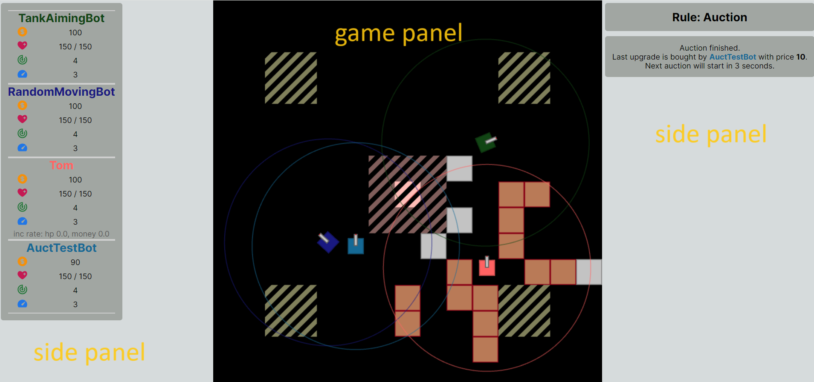
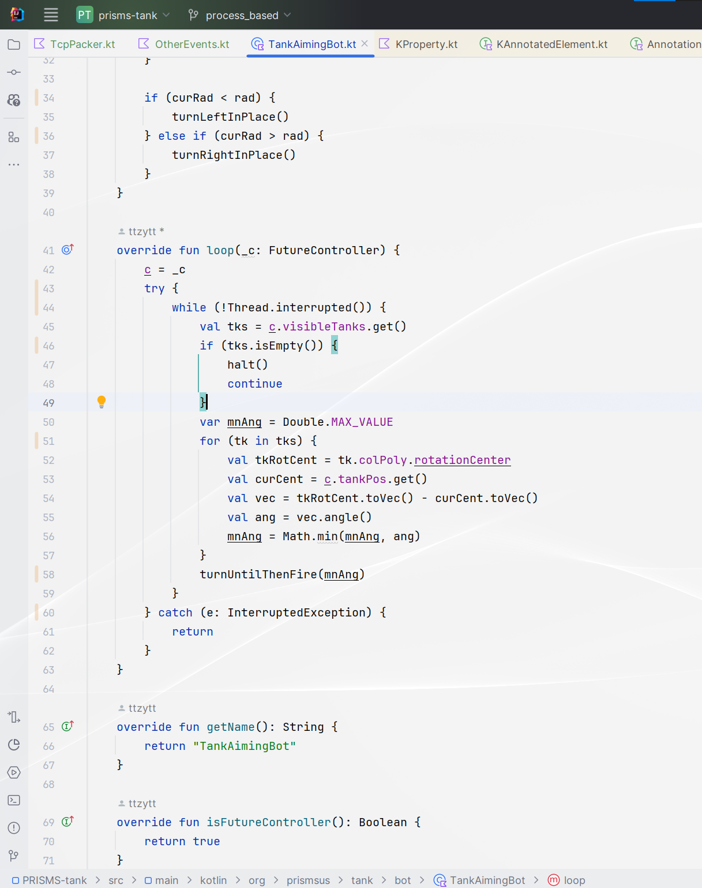
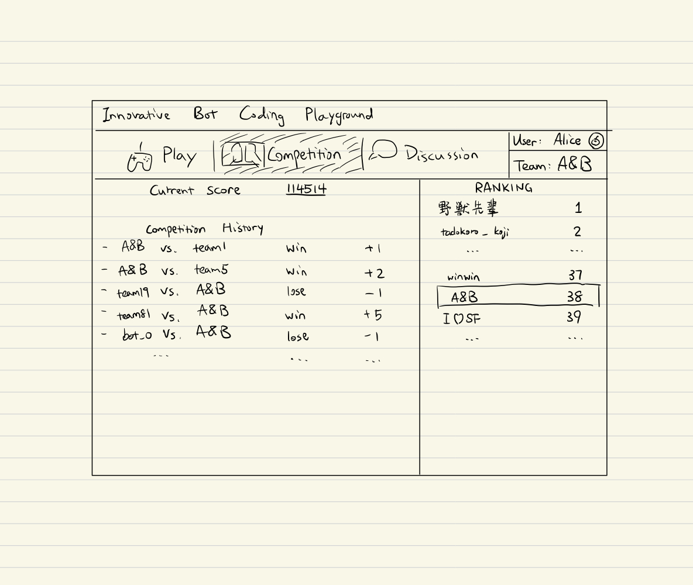
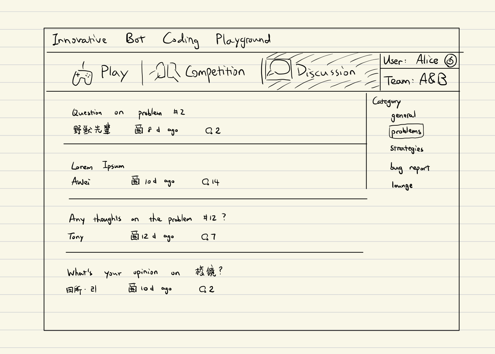

# Science Fair: IRB Supplemental Document

This document aims to provide a non-technical description for the IBCP (innovative Bot Coding Playground). It include mostly descriptions about the user interface. For detailed rules of the game, please refer to *Project Summary* and *Research Plan.* 

# Goal and Introduction

The goal of this project is to feature a graphical and game-based software for users in different levels to learn computer science topics. 

The project can be generally split into two parts: game and website. Through the game, users can write script for bots using Java/Kotlin programming language and compete with each other. The website extend the features of the game by providing a platform for different users to communicate. After accepting user-written bots, the website would be able to play matches between different bots and dynamically calculate rankings. Besides competition, users can post programming puzzles and discuss them. 

# Description of the Software

## Game

### User Interfacetl

The game in playing phase. The visible parts include game panel and side panels. The game panel is for displaying the current map of the game, while side panels for displaying information of the game state.

An example of IDE (integrated development interface) for users to write their bot scripts.  After finished writing the script and testing, they can submit it to the website for matches. 

Despite the game being a code competition game, it also allows players to directly control a tank. That is, the controller of a tank can be either a piece of code or a human player. This opens more possibility for playing IBCP:

- bot vs. bot
- bot vs. human
- human vs. human

### Replay

To provide users with a better debug experience, we implemented the replay functionality. When a match is finished, a replay file with all information about the game will be generated, with the file users will be able to review the game and make improvements. 

 

## Map Editor

Users can also create their own game map with the map editor provided by us. Users can easily and intuitively set the size, blocks, and additional regions in the map.

## Website

The game website will be essential for online competitions, problem solving, and discussions about the game.

We have not finished building our website yet. Therefore, all of the following descriptions are our future plan for the website.

### Competition

All contents related to online competitions will be displayed on the **competition** page.

In the website, everyone can register as a user and join a team. Each team will only submit one piece of code at a time, and thus, all competitions will host between teams.

One team can choose to “challenge” another team at any time, and the other team can choose to accept or reject the challenge. Once a challenge is accepted, the website will start one (or several) battle(s) using the code submitted by the two teams. Every team member can review the replay of their matches once their matches are done.

Each team will have a **ranking score** indicating its battle result with others. All teams’ initial ranking score are the same, and as the battles between teams go on, their ranking will go up or down depending on their wins and loses.

### Discussion

The discuss section of the website aims to provide a platform for users to communicate about programming puzzles and bot competitions. There are different categories for discussion sections, including general, problems, strategies, bug reports, and lounge. In the problems category users can discuss the solutions to certain programming puzzles; in the strategies category users can discuss about strategies used for matches. 

# Experimental Method

NOTE: the form we are going to use for the survey have been shared as a Google Form, for more detail please check: [https://docs.google.com/forms/d/1KwVLtWe-oKiIdgfTDV83W95DikLplAAComh_C6xHiWk/edit](https://docs.google.com/forms/d/1KwVLtWe-oKiIdgfTDV83W95DikLplAAComh_C6xHiWk/edit)

We will collect anonymous responses from our gaming website to evaluate the effectiveness of our project in its goal. Upon the registration of participants, a brief survey will be sent to evaluate his/her programming skill proficiency. After getting familiar with the rules of IBCP and submitting their code for competition, participants will receive another survey to evaluate their performance again. Both surveys will have similar difficulty and will be ordered randomly for different users (e.g. user 1 may receive survey A as their initial evaluation and survey B as their final evaluation, while user 2 may have the opposite). To ensure anonymity, we used Google Forms, and adjust the setting so that it will not collect any information making the user identifiable (for example, email address).

Our investigation aims to evaluate the effectiveness of our game in enhancing programming skills and providing a better learning experience. To ensure a diverse pool of participants, we will target individuals with varying levels of programming level, ranging from beginners to advanced users. The survey will include questions about their prior programming experience, the impact of the game on their skills, and their overall satisfaction with the platform.

Another important usage of user responses is to collecting feedbacks for further improvements on the functionalities of both the game and the website. There will be questions asking for evaluation on a 10-score scale of IBCP game design, game graphics, website design, challenge problems, and overall educational value. There will also be an additional space to fill out feedback beside all the questions. From these responses and feedback, we will better understand the target audience and improve the game, from which we can establish a better learning environment to cast a positive influence on computer science students.

