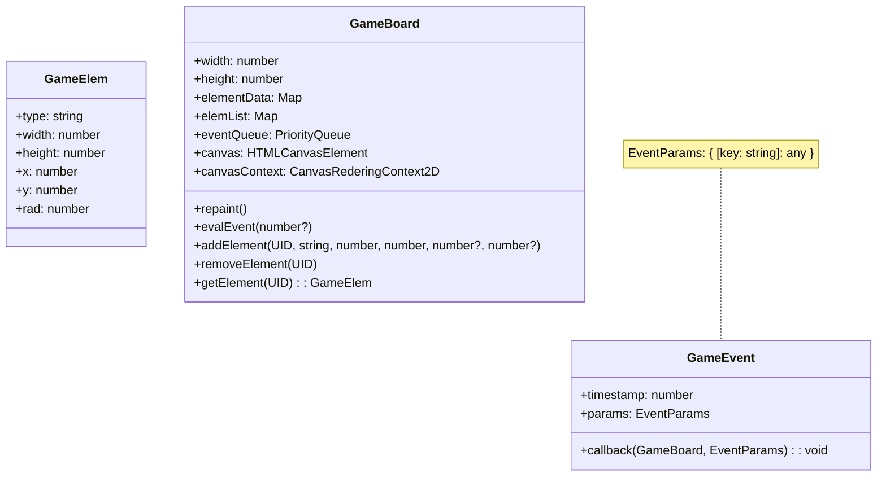
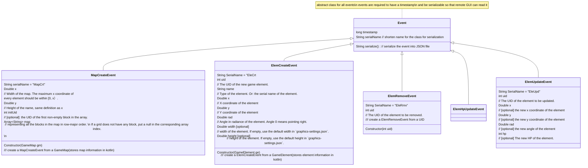

# UML diagrams

## GUI (typescript)

```mermaid
classDiagram
    class GameEvent{
        +timestamp: number
        +callback(GameBoard, EventParams): void
        +params: EventParams
    }
    note for GameEvent "EventParams: { [key: string]: any }"
    class GameElem{
        +type: string
        +width: number
        +height: number
        +x: number
        +y: number
        +rad: number
    }
    class GameBoard{
        +width: number
        +height: number
        +elementData: Map
        +elemList: Map
        +eventQueue: PriorityQueue
        +canvas: HTMLCanvasElement
        +canvasContext: CanvasRederingContext2D
        +repaint()
        +evalEvent(number?)
        +addElement(UID, string, number, number, number?, number?)
        +removeElement(UID)
        +getElement(UID): GameElem
    }
```

## Core (Java)

```mermaid
classDiagram
    Event <|-- MapCreateEvent
    Event <|-- ElemCreateEvent
    Event <|-- ElemRemoveEvent
    Event <|-- ElemHpUpdateEvent
    Event <|-- ElemUpdateEvent
    class Event{
        long timestamp
        String serialName  // shorten name for the class for serialization
        String serialize() // serialize the event into JSON file
    }
    note for Event "abstract class for all events\n events are required to have a timestamp\n and be serializable so that remote GUI can read it"

    class MapCreateEvent{
        String serialName = "MapCrt"
        Double x 
        // Width of the map. The maximum x coordinate of
        every element should be within [0, x）.
        Double y 
        // Height of the name, same definition as x
        int initUid 
        // [optional]: the UID of the first non-empty block in the array.
        Array~String~ map 
        // representing all the blocks in the map in row-major order. \n If a grid does not have any block, put a null in the corresponding array index.
        \n
        Constructor(GameMap gm)
        /// create a MapCreateEvent from a GameMap (stores map information in kotlin)
    }

    class ElemCreateEvent{
        String SerialName = "EleCrt
        int uid
        // The UID of the new game element.
        String name 
        // Type of the element. Or: the serial name of the element.
        Double x
        // X coordinate of the element
        Double y
        // Y coordinate of the element
        Double rad
        // Angle in radiance of the element. Angle 0 means pointing right.
        Double width [optional]
        // width of the element. If empty, use the default width in `graphics-settings.json`.
        Double height [optional]
        // height of the element. If empty, use the default height in `graphics-settings.json`.

        Constructor(GameElement ge)
        /// create a ElemCreateEvent from a GameElement (stores element information in kotlin)
    }

    class ElemRemoveEvent{
        String SerialName = "EleRmv"
        int uid
        // The UID of the element to be removed.
        Constructor(int uid)
        /// create a ElemRemoveEvent from a UID
    }

    class ElemUpdateEvent{
        String SerialName = "EleUpd"
        int uid
        // The UID of the element to be updated.
        Double x
        // [optional] the new x coordinate of the element
        Double y
        // [optional] the new y coordinate of the element
        Double rad
        // [optional] the new angle of the element
        int hp
        // [optional] The new HP of the element.
    }
```